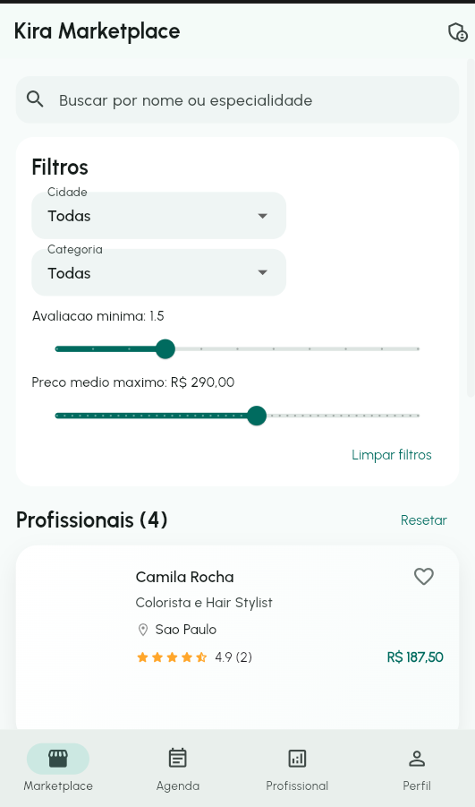
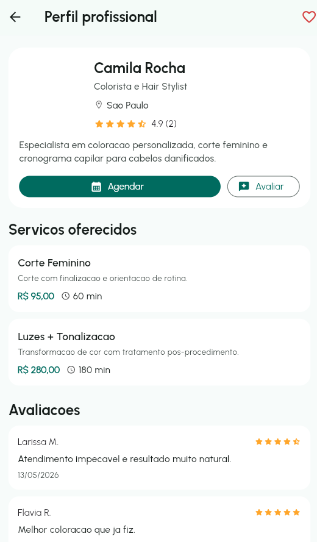
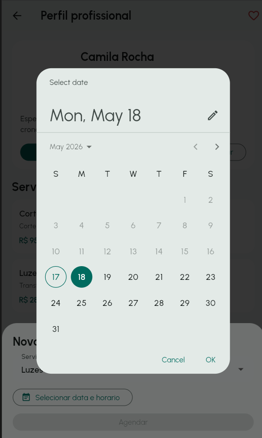
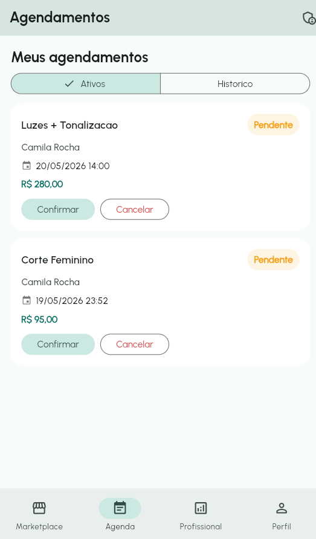
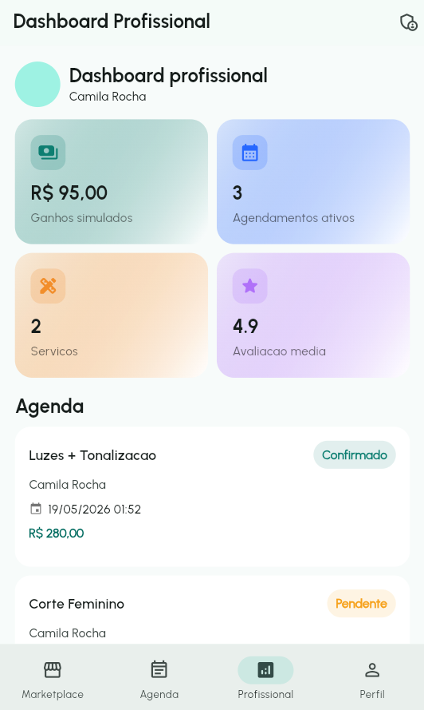
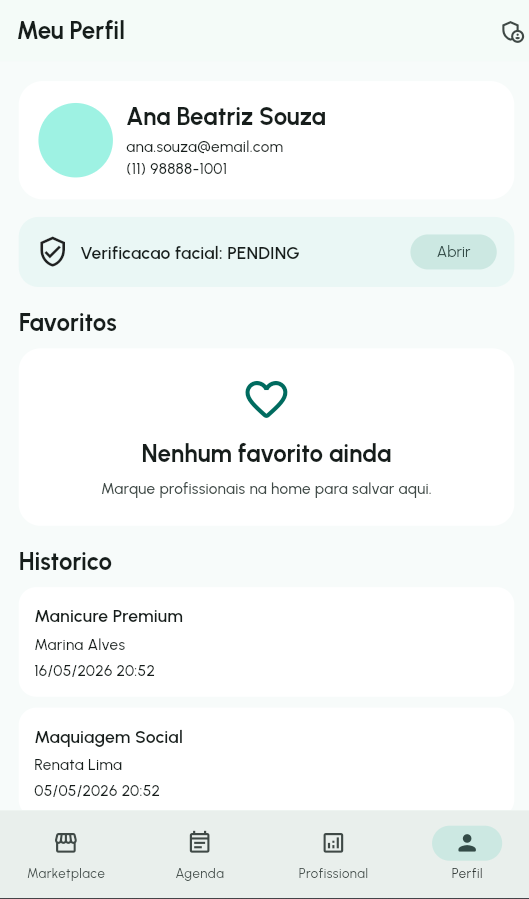

# Kira Marketplace - Prototipo Flutter

Prototipo funcional (frontend only) de um marketplace de servicos de estetica, desenvolvido para demonstracao academica (TCC).  
O projeto simula fluxos reais de contratacao de servicos, agendamento, avaliacoes e gestao profissional, com foco em UX, arquitetura limpa e escalabilidade para futura integracao com backend.

## Sumario

- [Visao geral](#visao-geral)
- [Stack tecnologica](#stack-tecnologica)
- [Arquitetura](#arquitetura)
- [Funcionalidades implementadas](#funcionalidades-implementadas)
- [Principais telas (prints)](#principais-telas-prints)
- [Como executar](#como-executar)
- [Qualidade e organizacao](#qualidade-e-organizacao)
- [Proximos passos](#proximos-passos)

## Visao geral

O **Kira Marketplace** conecta profissionais autonomos de estetica (cabelo, unhas, maquiagem, estetica facial, barbearia e massagem) a clientes que desejam contratar servicos.

Este prototipo foi construido para:

- validar experiencia do usuario ponta a ponta;
- demonstrar fluxos criticos sem backend real;
- sustentar apresentacao visual e tecnica do projeto final;
- preparar uma base organizada para integracao futura com Spring Boot.

## Stack tecnologica

- **Flutter** (Material Design 3)
- **Dart**
- **Provider** (gerenciamento de estado)
- **SharedPreferences** (persistencia local simples)
- **Intl** (formatacao de data/moeda)

## Arquitetura

Estrutura utilizada no projeto:

```text
lib
|- core
|  |- constants
|  |- mock
|  |- theme
|  `- utils
|- models
|- pages
|  |- admin
|  |- auth
|  |- booking
|  |- home
|  |- professional
|  `- profile
|- providers
|- services
|- widgets
`- main.dart
```

Decisoes de arquitetura:

- **Separacao por camadas**: UI, estado, dominio e utilitarios desacoplados.
- **Estado centralizado por Provider**: filtros, CRUD local e fluxos compartilhados.
- **Componentizacao**: widgets reutilizaveis para cards, formularios, status e listas.
- **Dados mockados tipados**: simulacao realista com models e enums.
- **Preparado para evolucao**: services e providers organizados para migracao incremental para backend.

## Funcionalidades implementadas

- Splash Screen com animacao e redirecionamento.
- Onboarding em multiplas etapas.
- Home marketplace com busca e filtros (cidade, categoria, avaliacao minima e preco medio).
- Detalhe do profissional com bio, servicos ativos, avaliacoes, favoritar e acao de agendar.
- CRUD local de servicos (criar, editar, excluir, ativar/desativar).
- CRUD local de agendamentos (criar, confirmar, concluir, cancelar, historico).
- Avaliacoes com nota (1 a 5) e comentario.
- Perfil do usuario com dados pessoais, favoritos e historico.
- Dashboard profissional com agenda, metricas e ganhos simulados.
- Fluxo mockado de verificacao facial (APPROVED/PENDING/REJECTED).
- Painel administrativo com metricas fake globais.

## Principais telas (prints)

> Os prints abaixo documentam os principais fluxos da aplicacao.

### 1) Home Marketplace



### 2) Perfil profissional



### 3) Agendamento (seletor de data)



### 4) Meus agendamentos



### 5) Dashboard profissional



### 6) Meu perfil



## Como executar

Pre-requisitos:

- Flutter SDK instalado
- Dispositivo/emulador ou navegador

Instalacao:

```bash
flutter pub get
```

Executar em modo debug (web):

```bash
flutter run -d edge --web-port 8080
```

Executar build web estavel:

```bash
flutter build web
dart run tool/local_web_server.dart 8080
```

## Qualidade e organizacao

Comando de analise estatica:

```bash
flutter analyze
```

Boas praticas adotadas:

- tipagem forte com models e enums;
- estado unidirecional com `ChangeNotifier`;
- responsabilidades separadas por pasta/camada;
- design system basico (tema global, cores e tipografia);
- componentes de UI reutilizaveis;
- loading states e empty states.

## Proximos passos

- Integracao de API (Spring Boot) mantendo contratos dos models.
- Persistencia real de autenticacao e sessao.
- Upload real de documentos/selfie para verificacao.
- Camada de testes de widget/integrados por fluxo critico.
- Telemetria de uso (analytics) para validacao de UX.

---

## Observacoes

- Este projeto e um **prototipo frontend** para demonstracao.
- Nao ha backend real, autenticacao real ou banco de dados externo.
